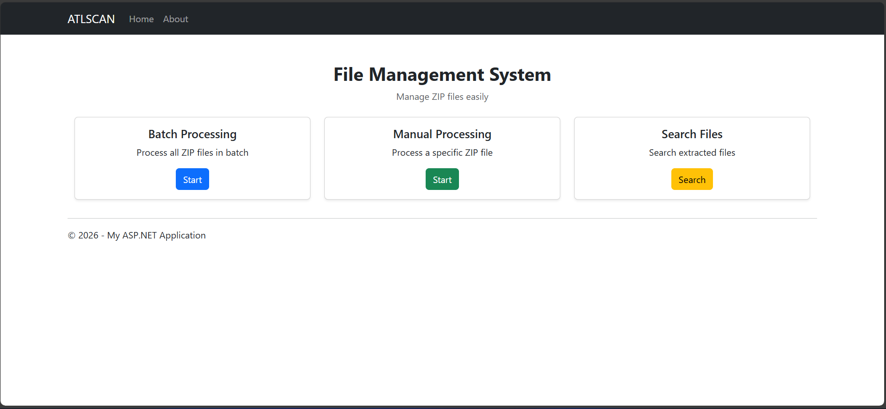
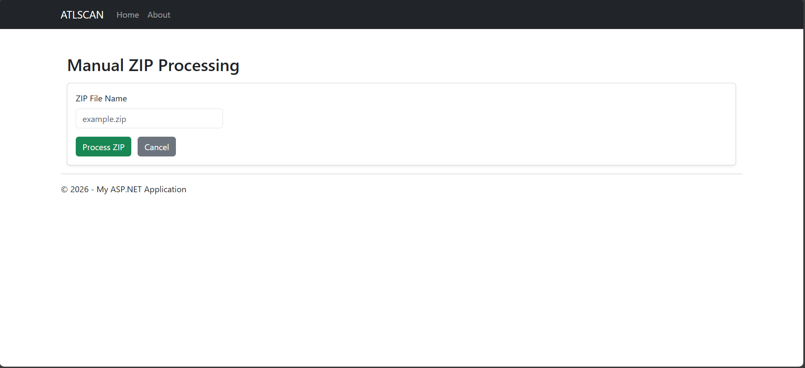
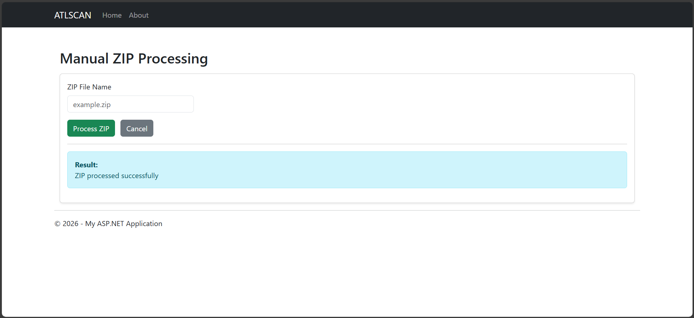
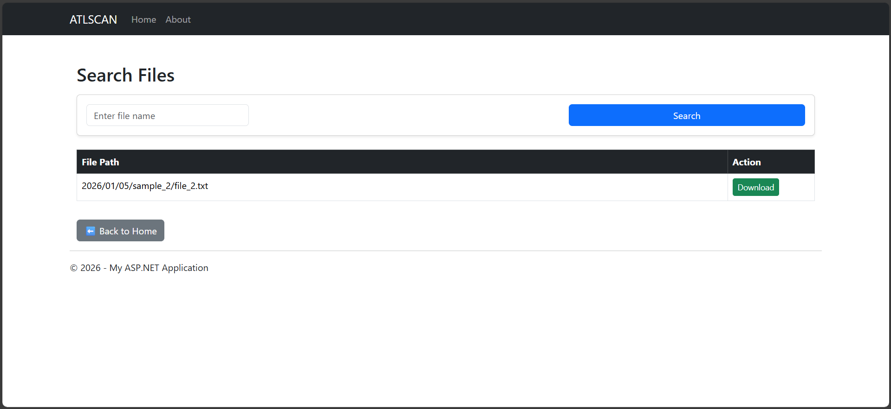
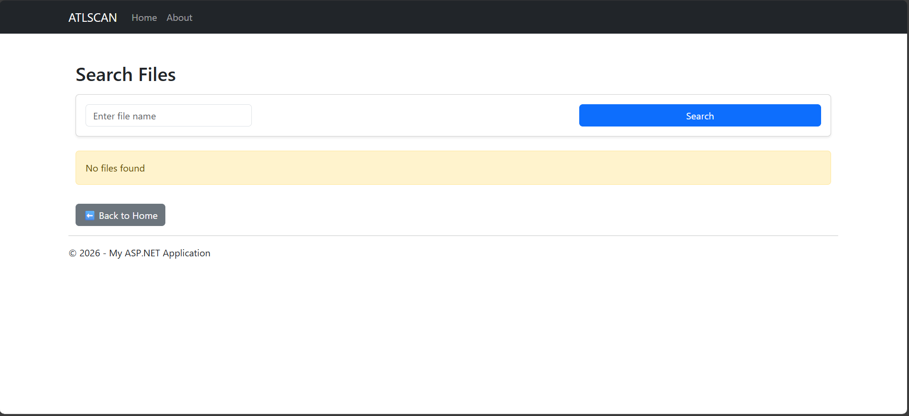

# FileRetrieval APP – ZIP File Processing System (ASP.NET MVC + WCF)

ATLSCAN is a ZIP file processing system built using **ASP.NET MVC** for the UI and **WCF** for backend services.  
It allows users to batch-process ZIP files, manually process specific ZIPs, and search/download extracted files through a web interface.

---

## 🧱 Architecture Overview

ASP.NET MVC UI (APPUI)
|
| (WCF Client – Connected Service)
v
WCF Service (APPService)
|
v
File System (SourceZips → Destination)

- **UI Layer:** APPUI (ASP.NET MVC)
- **Service Layer:** APPService (WCF)
- **Storage:** Local file system

---

## 🚀 Features

### ✅ Batch ZIP Processing
- Processes all ZIP files present in `SourceZips`
- Automatically extracts contents to `Destination/YYYY/MM/DD`

### ✅ Manual ZIP Processing
- Process a specific ZIP file by name
- Uses WCF service call to extract contents

### ✅ Search Extracted Files
- Search extracted files by filename
- Download files directly from UI

### ✅ Logging
- Logs maintained under `Logs/`

---

## 🖥️ User Interface Screens

### Home Dashboard
Main entry point with all available actions.



---

### Manual ZIP Processing
Process a specific ZIP file by providing its name.



---

### Manual ZIP Processing – Success
Confirmation message after successful processing.



---

### Search Files
Search and download extracted files.



---

### Search – No Results
Shown when no matching files are found.



---

## 🛠️ Technology Stack

| Layer | Technology |
|-----|-----------|
| UI | ASP.NET MVC (.NET Framework 4.8) |
| Backend | WCF |
| Styling | Bootstrap 5 |
| Client Calls | WCF Connected Services |
| Logging | Custom Logger |
| Compression | System.IO.Compression |

---

## 📂 Project Structure
```bash
ZipSystem/
│
├── Application/
│ ├── ALTSCANUI/ # ASP.NET MVC UI
│ │ ├── Controllers/
│ │ │ └── HomeController.cs
│ │ ├── Views/
│ │ │ ├── Home/
│ │ │ │ ├── Index.cshtml
│ │ │ │ ├── Batch.cshtml
│ │ │ │ ├── Manual.cshtml
│ │ │ │ └── Search.cshtml
│ │ └── Services/
│ │ └── ServiceClient.cs
│ │
│ └── ATLSCANService/ # WCF Service
│ ├── ZipService.svc
│ ├── ZipService.svc.cs
│ ├── ZipProcessor.cs
│ ├── IZipService.cs
│ └── Logger.cs
│
├── SourceZips/ # Input ZIP files
├── Destination/ # Extracted files
└── Logs/ # Application logs
```


## ⚙️ Setup Instructions

### 1️⃣ Clone Repository
```
git clone https://github.com/anugraheeth/WCF.git
```

### 2️⃣ Open Solution
```
Open Visual Studio

Load the solution files under Application/
```

### 3️⃣ Configure Startup Projects
```
Set Multiple Startup Projects:

ATLSCANService → Start

ALTSCANUI → Start
```

### 4️⃣ Verify Paths
```
Ensure these directories exist:
SourceZips/
Destination/
Logs/
(Adjust paths in Web.config if needed.)
```

### 5️⃣ Run
Press F5
```

UI launches in browser

WCF service runs in IIS Express

📥 How It Works
Batch Processing
Place ZIP files in SourceZips

Click Batch Processing

Files extracted to date-based folders

Manual Processing
Enter ZIP filename (e.g., example.zip)

Click Process ZIP

WCF service extracts the file

Search
Enter file name or partial name

View results

Download directly
```

🔐 Notes
```
ZIP filenames are case-sensitive

Ensure WCF service is running before UI

Large ZIP files may take time to process
```
📄 License
MIT License

👤 Author
Anugraheeth
GitHub: https://github.com/anugraheeth

⭐ If this project helped you, give it a star!
